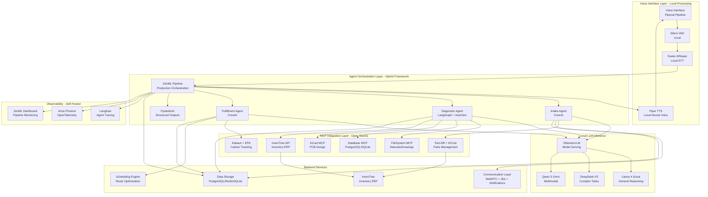
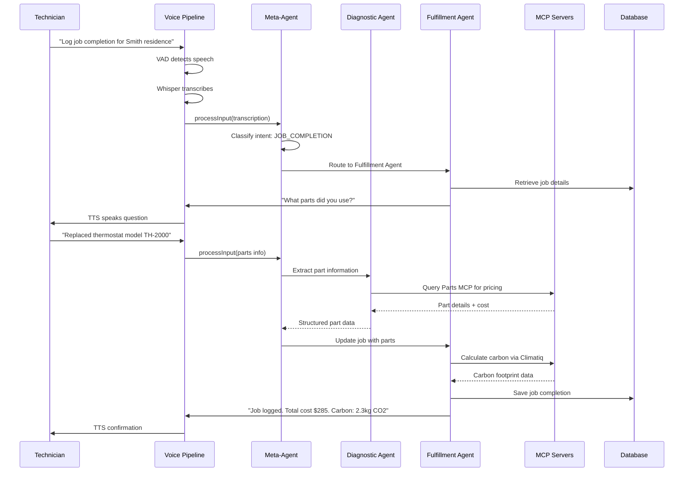
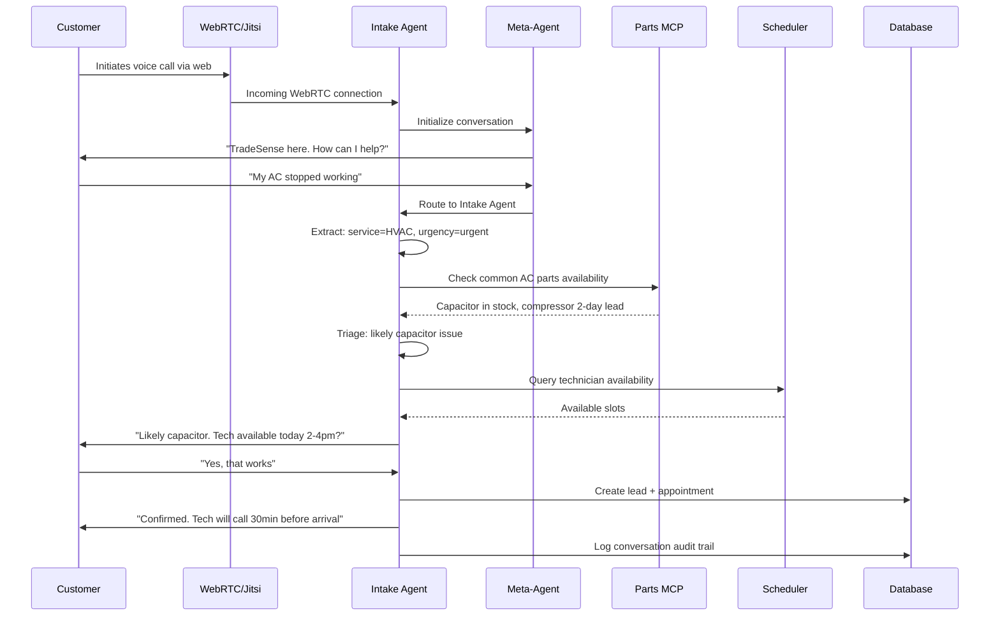
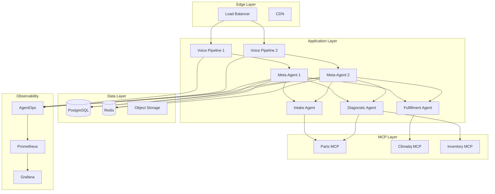

# Design Document: TradeSense Agentic Field Service Management System

## Overview

TradeSense is an autonomous, voice-first agentic operating system designed to address the 2026 field service sector crisis by reducing cognitive load on field professionals through multi-agent orchestration, Model Context Protocol (MCP) integration, and real-time voice interaction. The system transforms traditional Field Service Management from a UI-heavy workflow into an intelligent, hands-free ecosystem that autonomously handles intake, diagnostics, parts sourcing, scheduling, and sustainability compliance.

**Zero-Cost Open-Source Architecture**: TradeSense achieves complete data sovereignty and zero operational costs (after initial hardware investment) by leveraging local LLM inference (Llama 4, DeepSeek-V3, Qwen 3), open-source orchestration (ZenML, CrewAI, LangGraph, AutoGen), local voice processing (Faster-Whisper, Piper TTS), and self-hosted observability (Langfuse, Arize Phoenix). The system eliminates $11,400-$46,800 in annual SaaS costs while maintaining production-grade performance.

By combining ZenML pipeline orchestration, hybrid agent frameworks (CrewAI for operational tasks, LangGraph for diagnostics, AutoGen for troubleshooting), and a sub-500ms local voice pipeline, TradeSense aims to reduce administrative overhead by 20%, increase first-time fix rates, and enable 15% more daily job capacity. The system scales from solo technicians (32GB laptop) to 50-person shops (enterprise GPU servers) with complete data sovereignty.

## Architecture

### System Overview



### Architecture Layers

**Voice Interface Layer - Local Processing**: Handles real-time speech-to-speech interaction with <500ms latency using fully local processing. Silero VAD detects speech boundaries in noisy field environments, Faster-Whisper (optimized Whisper) performs local STT with <500ms first-token latency, and Piper TTS provides fast neural voice synthesis. Pipecat orchestrates the voice pipeline with LiveKit Agents for optional distributed deployment. Zero API costs, complete data privacy.

**Agent Orchestration Layer - Hybrid Framework**: ZenML provides production-grade pipeline orchestration with built-in secrets management and governance. Intake Agent (CrewAI) handles role-based lead capture workflows, Diagnostic Agent (LangGraph + AutoGen) combines graph-based reasoning with conversational troubleshooting, and Fulfillment Agent (CrewAI) manages multi-step completion workflows. PydanticAI ensures typed, structured outputs for precision tools. All agents use local LLM inference.

**Local LLM Inference**: Ollama provides Docker-like simplicity for small shops with auto-quantization, while vLLM offers high-performance serving with PagedAttention (19x faster) for larger deployments. LocalAI acts as unified API hub for routing text/image/audio requests. Models: Llama 4 Scout/Maverick (general reasoning, 128k context), DeepSeek-V3 (671B MoE for complex tasks), Qwen 3 Omni (multimodal vision/audio), Gemma 3 27B (vision understanding), Command R+ (RAG-optimized). Hardware requirements: 16-32GB RAM (solo), 64GB+ (shop), 80GB+ VRAM (precision manufacturing).

**MCP Integration Layer - Open Source**: FileSystem MCP provides access to local manuals and technical drawings. Database MCP integrates PostgreSQL/SQLite. KiCad MCP enables PCB design through natural language. InvenTree API provides full-featured inventory ERP with REST API. Part-DB manages electronic component databases with KiCad 8+ integration. KiCost performs zero-cost distributor scraping (Digi-Key, Mouser, Arrow, Newark, TME). Kabaun + open emission datasets (eGRID, EPA GHG, ADEME) replace proprietary carbon tracking. Puppeteer MCP enables browser automation for legacy systems.

**Backend Services**: Communication layer uses WebRTC for web-based voice interactions, Jitsi for video consultations, Web Push + Email for notifications, and optional FreeSWITCH for traditional phone system ($2-5/month). Scheduling engine optimizes routes. PostgreSQL provides primary data store, SQLite for local inventory, Redis for caching. InvenTree serves as open-source inventory ERP with Python/Django backend.

**Observability - Self-Hosted**: Langfuse provides agent graph visualization and DAG tracing (self-hosted). Arize Phoenix offers OpenTelemetry-based debugging (self-hosted). ZenML includes built-in pipeline monitoring dashboard. PostHog optional for session analytics. Zero SaaS fees, complete data sovereignty.

## Components and Interfaces

### Component 1: ZenML Pipeline Orchestrator

**Purpose**: Provides production-grade pipeline orchestration, secrets management, governance, and workflow coordination across all agents. Replaces traditional meta-agent pattern with declarative pipeline definitions.

**Interface**:
```typescript
interface ZenMLOrchestrator {
  // Initialize orchestrator with configuration
  initialize(config: ZenMLConfig): Promise<void>
  
  // Define and register pipeline
  registerPipeline(pipeline: Pipeline): Promise<string>
  
  // Execute pipeline with inputs
  executePipeline(pipelineId: string, inputs: PipelineInputs): Promise<PipelineRun>
  
  // Monitor pipeline execution
  getPipelineStatus(runId: string): Promise<PipelineStatus>
  
  // Retrieve pipeline artifacts
  getArtifacts(runId: string): Promise<Artifact[]>
  
  // Manage secrets for API keys and credentials
  setSecret(key: string, value: string): Promise<void>
  getSecret(key: string): Promise<string>
}

interface ZenMLConfig {
  stackName: string
  orchestrator: 'local' | 'kubernetes' | 'airflow'
  artifactStore: string
  containerRegistry?: string
  secretsManager: 'local' | 'vault'
}

interface Pipeline {
  name: string
  steps: PipelineStep[]
  schedule?: CronExpression
  enableCache: boolean
}

interface PipelineStep {
  name: string
  agent: 'intake' | 'diagnostic' | 'fulfillment'
  inputs: string[]
  outputs: string[]
  retryPolicy: RetryPolicy
}

interface PipelineRun {
  id: string
  pipelineId: string
  status: 'running' | 'completed' | 'failed'
  startTime: number
  endTime?: number
  artifacts: Artifact[]
}
```

**Responsibilities**:
- Define declarative pipelines for voice interaction workflows
- Coordinate agent execution with dependency management
- Manage secrets for WebRTC, Jitsi, email, and database credentials
- Track pipeline artifacts and lineage
- Provide governance and audit trails
- Handle pipeline caching and optimization
- Emit telemetry to Langfuse/Phoenix

### Component 2: Intake Agent (CrewAI)

**Purpose**: Handles initial lead capture, customer triage, and 24/7 availability via WebRTC/Jitsi integration using CrewAI for role-based agent collaboration and local LLM inference.

**Interface**:
```typescript
interface IntakeAgent {
  // Capture new lead from voice/SMS
  captureLead(input: LeadInput): Promise<Lead>
  
  // Classify urgency and service type using local LLM
  triageLead(lead: Lead): Promise<TriageResult>
  
  // Schedule initial consultation
  scheduleConsultation(lead: Lead, availability: TimeSlot[]): Promise<Appointment>
  
  // Query parts availability via InvenTree/Part-DB
  checkPartsAvailability(parts: PartQuery[]): Promise<PartAvailability[]>
  
  // Use PydanticAI for structured output extraction
  extractStructuredData(text: string, schema: Schema): Promise<any>
}

interface LeadInput {
  source: 'voice' | 'sms' | 'web'
  customerInfo: CustomerInfo
  issueDescription: string
  urgency: 'emergency' | 'urgent' | 'routine'
  location: GeoLocation
}

interface TriageResult {
  serviceType: string
  estimatedDuration: number
  requiredSkills: string[]
  suggestedTechnicians: string[]
  priority: number
  confidence: number
}
```

**Responsibilities**:
- Process inbound WebRTC voice calls and web-based interactions 24/7
- Handle Jitsi video consultations for complex issues
- Send notifications via Web Push, Email, and Discord webhooks
- Extract structured information using PydanticAI + local LLM
- Classify service type and urgency with Llama 4
- Query InvenTree API for initial availability checks
- Query Part-DB for component specifications
- Create lead records in PostgreSQL
- Notify appropriate technicians
- Use CrewAI role-based collaboration for complex intake scenarios

### Component 3: Diagnostic Agent (LangGraph + AutoGen)

**Purpose**: Performs intelligent troubleshooting, multimodal analysis (image parsing for equipment labels), and real-time parts sourcing using LangGraph for complex reasoning chains and AutoGen for conversational collaborative troubleshooting. Uses local multimodal LLMs (Qwen 3 Omni, Gemma 3).

**Interface**:
```typescript
interface DiagnosticAgent {
  // Analyze issue description and context using LangGraph
  diagnoseIssue(issue: IssueDescription): Promise<Diagnosis>
  
  // Parse equipment labels from images using Qwen 3 Omni or Gemma 3
  parseEquipmentImage(image: ImageData): Promise<EquipmentInfo>
  
  // Find required parts with alternatives via InvenTree + KiCost
  findParts(diagnosis: Diagnosis): Promise<PartsRecommendation>
  
  // Access inventory via InvenTree API
  queryInventory(partIds: string[]): Promise<InventoryStatus[]>
  
  // Generate step-by-step repair guide using local LLM
  generateRepairGuide(diagnosis: Diagnosis): Promise<RepairGuide>
  
  // Collaborative troubleshooting with AutoGen conversational agents
  collaborativeTroubleshoot(issue: IssueDescription, technician: User): Promise<TroubleshootingSession>
  
  // Access technical documentation via FileSystem MCP + LlamaIndex RAG
  queryDocumentation(query: string): Promise<DocumentationResult[]>
}

interface Diagnosis {
  issueType: string
  rootCause: string
  confidence: number
  requiredParts: Part[]
  estimatedRepairTime: number
  complexity: 'simple' | 'moderate' | 'complex'
  reasoningSteps: string[]
}

interface PartsRecommendation {
  primary: Part[]
  alternatives: Part[][]
  totalCost: number
  availability: 'in-stock' | 'order-required' | 'unavailable'
  distributorOptions: DistributorOption[]
}

interface DistributorOption {
  distributor: 'digikey' | 'mouser' | 'arrow' | 'newark' | 'tme'
  price: number
  leadTime: number
  quantity: number
}
```

**Responsibilities**:
- Analyze issue descriptions using LangGraph reasoning chains with DeepSeek-V3
- Parse equipment images for model numbers using Qwen 3 Omni or Gemma 3 (local vision models)
- Query InvenTree API for real-time inventory and pricing
- Query Part-DB for electronic component specifications
- Use KiCost for automated distributor price comparison (Digi-Key, Mouser, Arrow, Newark, TME)
- Suggest alternative parts when primary unavailable
- Generate detailed repair instructions using Llama 4
- Provide collaborative troubleshooting via AutoGen conversational agents
- Access technical manuals via FileSystem MCP + LlamaIndex event-driven RAG
- Update diagnosis confidence based on technician feedback

### Component 4: Fulfillment Agent (CrewAI)

**Purpose**: Manages job completion, scheduling optimization, carbon tracking, and automated reporting using CrewAI for multi-step workflows and role-based collaboration. Uses open-source carbon tracking (Kabaun + EPA datasets).

**Interface**:
```typescript
interface FulfillmentAgent {
  // Optimize technician schedule and routes
  optimizeSchedule(jobs: Job[], technicians: Technician[]): Promise<Schedule>
  
  // Log job completion details
  logJobCompletion(job: Job, details: CompletionDetails): Promise<void>
  
  // Calculate carbon footprint via Kabaun + open emission datasets
  calculateCarbonFootprint(job: Job): Promise<CarbonFootprint>
  
  // Generate compliance reports
  generateReport(period: DateRange, type: ReportType): Promise<Report>
  
  // Track AI infrastructure emissions via CodeCarbon
  trackInfrastructureEmissions(): Promise<InfrastructureEmissions>
}

interface Schedule {
  assignments: JobAssignment[]
  routes: Route[]
  estimatedCompletionTime: number
  utilizationRate: number
}

interface CarbonFootprint {
  totalEmissions: number
  breakdown: EmissionSource[]
  complianceStatus: 'compliant' | 'warning' | 'non-compliant'
  recommendations: string[]
  dataSources: string[]
}

interface EmissionSource {
  category: 'travel' | 'parts' | 'disposal' | 'ai-infrastructure'
  emissions: number
  dataSource: 'eGRID' | 'EPA-GHG' | 'ADEME' | 'Kabaun' | 'CodeCarbon'
}

interface InfrastructureEmissions {
  cpuEmissions: number
  gpuEmissions: number
  totalPowerConsumption: number
  carbonIntensity: number
  region: string
}
```

**Responsibilities**:
- Optimize daily schedules using route optimization algorithms
- Coordinate with technicians for job assignments
- Log completion details hands-free via voice
- Calculate carbon emissions using Kabaun (50,000+ emission factors)
- Query eGRID for electricity generation emissions
- Query EPA GHG Emission Factors Hub for business travel/logistics
- Query ADEME for international trade emissions
- Track AI infrastructure emissions via CodeCarbon
- Monitor Cloud Carbon Footprint for server infrastructure
- Generate automated sustainability reports
- Track KPIs (first-time fix rate, job capacity)
- Handle invoice generation and customer notifications
- Use CrewAI role-based agents for complex fulfillment workflows

### Component 5: Voice Pipeline (Local Processing)

**Purpose**: Provides real-time speech-to-speech interaction with <500ms latency, noise robustness, and 95%+ turn-taking accuracy using Pipecat orchestration. Fully local processing with zero API costs and complete data privacy.

**Interface**:
```typescript
interface VoicePipeline {
  // Initialize pipeline with configuration
  initialize(config: VoicePipelineConfig): Promise<void>
  
  // Start voice session
  startSession(sessionId: string): Promise<VoiceSession>
  
  // Process audio stream with local Faster-Whisper
  processAudioStream(stream: AudioStream): AsyncIterator<TranscriptionChunk>
  
  // Synthesize speech response with local Piper TTS
  synthesizeSpeech(text: string, voice: VoiceConfig): Promise<AudioBuffer>
  
  // Handle interruptions and turn-taking
  handleInterruption(session: VoiceSession): void
}

interface VoicePipelineConfig {
  vad: {
    model: 'silero'
    threshold: number
    minSpeechDuration: number
  }
  asr: {
    model: 'faster-whisper-large-v3' | 'faster-whisper-medium'
    language: string
    streaming: boolean
    device: 'cpu' | 'cuda'
    computeType: 'int8' | 'float16' | 'float32'
  }
  tts: {
    provider: 'piper'
    voice: string
    speed: number
    quality: 'low' | 'medium' | 'high'
  }
  latencyTarget: number // milliseconds (target: 500ms)
  localInference: boolean // always true
}

interface VoiceSession {
  sessionId: string
  state: 'listening' | 'processing' | 'speaking'
  context: ConversationContext
  metrics: SessionMetrics
  localProcessing: boolean
}
```

**Responsibilities**:
- Detect speech boundaries in noisy field environments using Silero VAD (local)
- Transcribe audio with Faster-Whisper (optimized Whisper, <500ms first-token latency)
- Maintain <500ms end-to-end latency for local processing
- Handle natural turn-taking and interruptions
- Synthesize natural-sounding responses with Piper TTS (sub-second response)
- Adapt to background noise levels
- Stream partial transcriptions for responsiveness
- Support distributed deployment via LiveKit Agents (optional)
- Ensure complete data privacy (no cloud API calls)
- Support CPU and GPU acceleration
- Use quantization (int8) for resource-constrained devices

### Component 6: MCP Integration Manager (Open Source)

**Purpose**: Manages connections to open-source MCP servers, handles JSON-RPC 2.0 communication, and provides unified tool interface for agents. Integrates FileSystem, Database, KiCad, InvenTree, Part-DB, and Puppeteer MCP servers.

**Interface**:
```typescript
interface MCPIntegrationManager {
  // Connect to MCP server
  connectServer(config: MCPServerConfig): Promise<MCPConnection>
  
  // List available tools from server
  listTools(serverId: string): Promise<MCPTool[]>
  
  // Execute tool via JSON-RPC 2.0
  executeTool(serverId: string, tool: string, params: any): Promise<any>
  
  // Handle server-sent events for remote servers
  subscribeToEvents(serverId: string, handler: EventHandler): void
  
  // Query InvenTree API for inventory management
  queryInvenTree(endpoint: string, params: any): Promise<any>
  
  // Query Part-DB for component specifications
  queryPartDB(partId: string): Promise<PartSpecification>
  
  // Execute KiCost for distributor price comparison
  executeKiCost(bomFile: string): Promise<DistributorPricing>
}

interface MCPServerConfig {
  id: string
  name: string
  transport: 'stdio' | 'sse'
  command?: string // for stdio
  url?: string // for SSE
  capabilities: string[]
  serverType: 'filesystem' | 'database' | 'kicad' | 'inventree' | 'puppeteer' | 'sequential-thinking'
}

interface MCPTool {
  name: string
  description: string
  inputSchema: JSONSchema
  outputSchema: JSONSchema
}

interface PartSpecification {
  id: string
  name: string
  category: string
  manufacturer: string
  datasheet: string
  footprint: string
  kicadSymbol: string
  parameters: Record<string, any>
}

interface DistributorPricing {
  part: string
  distributors: {
    name: string
    sku: string
    price: number
    quantity: number
    leadTime: number
    url: string
  }[]
  bestPrice: number
  bestDistributor: string
}
```

**Responsibilities**:
- Establish connections to FileSystem MCP for local manuals/drawings access
- Connect to Database MCP for PostgreSQL/SQLite integration
- Integrate KiCad MCP for PCB design through natural language
- Connect to InvenTree API for full-featured inventory ERP
- Integrate Part-DB for electronic component database management
- Execute KiCost for zero-cost distributor scraping (Digi-Key, Mouser, Arrow, Newark, TME)
- Use Puppeteer MCP for browser automation of legacy systems
- Integrate Sequential Thinking MCP for dynamic problem-solving
- Handle stdio transport for local servers
- Handle SSE transport for remote servers
- Serialize/deserialize JSON-RPC 2.0 messages
- Provide unified tool interface to agents
- Handle connection failures and retries
- Cache tool schemas for performance

## Data Models

### Model 1: Lead

```typescript
interface Lead {
  id: string
  customerId: string
  source: 'voice' | 'sms' | 'web'
  status: 'new' | 'triaged' | 'scheduled' | 'completed' | 'cancelled'
  issueDescription: string
  urgency: 'emergency' | 'urgent' | 'routine'
  serviceType: string
  location: GeoLocation
  createdAt: number
  updatedAt: number
  assignedTechnicianId?: string
  estimatedValue: number
}

interface GeoLocation {
  latitude: number
  longitude: number
  address: string
  city: string
  state: string
  zipCode: string
}
```

**Validation Rules**:
- id must be unique UUID
- customerId must reference valid customer
- source must be one of allowed values
- urgency must be classified within 60 seconds of intake
- location must have valid coordinates
- estimatedValue must be non-negative


### Model 2: Job

```typescript
interface Job {
  id: string
  leadId: string
  technicianId: string
  status: 'scheduled' | 'in-progress' | 'completed' | 'cancelled'
  scheduledStart: number
  scheduledEnd: number
  actualStart?: number
  actualEnd?: number
  diagnosis?: Diagnosis
  partsUsed: Part[]
  laborHours: number
  totalCost: number
  customerSignature?: string
  photos: string[]
  notes: string
  carbonFootprint?: CarbonFootprint
}

interface Part {
  id: string
  name: string
  manufacturer: string
  modelNumber: string
  quantity: number
  unitCost: number
  source: 'inventory' | 'ordered' | 'customer-supplied'
}
```

**Validation Rules**:
- id must be unique UUID
- leadId must reference valid lead
- technicianId must reference valid technician
- scheduledEnd must be after scheduledStart
- actualEnd must be after actualStart if both present
- partsUsed must have valid part IDs
- laborHours must be non-negative
- totalCost must match parts + labor calculation
- photos must be valid URLs or base64 encoded

### Model 3: ConversationContext

```typescript
interface ConversationContext {
  sessionId: string
  userId: string
  userRole: 'technician' | 'customer' | 'dispatcher'
  currentIntent: Intent
  entities: Entity[]
  history: ConversationTurn[]
  state: Record<string, any>
  metadata: {
    startTime: number
    turnCount: number
    activeAgents: string[]
  }
}


interface Intent {
  name: string
  confidence: number
  parameters: Record<string, any>
}

interface Entity {
  type: string
  value: string
  confidence: number
  span: [number, number]
}

interface ConversationTurn {
  speaker: 'user' | 'agent'
  content: string
  timestamp: number
  agent?: string
  actions: Action[]
}
```

**Validation Rules**:
- sessionId must be unique per conversation
- userId must reference valid user
- currentIntent confidence must be 0-1
- history must be chronologically ordered
- turnCount must match history length
- activeAgents must reference valid agent IDs

### Model 4: MCPToolCall

```typescript
interface MCPToolCall {
  id: string
  serverId: string
  toolName: string
  parameters: Record<string, any>
  result?: any
  error?: MCPError
  timestamp: number
  duration: number
  agentId: string
}

interface MCPError {
  code: number
  message: string
  data?: any
}
```

**Validation Rules**:
- id must be unique UUID
- serverId must reference connected MCP server
- toolName must exist in server's tool list
- parameters must match tool's input schema
- result must match tool's output schema if present
- duration must be non-negative
- agentId must reference valid agent

## Main Algorithm/Workflow

### Voice-Driven Job Logging Sequence



### Lead Intake and Triage Sequence



## Key Functions with Formal Specifications

### Function 1: routeToAgent()

```typescript
function routeToAgent(intent: Intent, context: ConversationContext): Promise<Agent>
```

**Preconditions:**
- `intent` is non-null with confidence > 0.6
- `intent.name` is one of recognized intent types
- `context.sessionId` references active session
- At least one specialized agent is available

**Postconditions:**
- Returns agent instance capable of handling intent
- Agent is initialized with conversation context
- Routing decision is logged to audit trail
- If no suitable agent found, returns fallback agent
- Routing latency < 50ms

**Loop Invariants:** N/A (no loops in function)

### Function 2: processAudioStream()

```typescript
function processAudioStream(stream: AudioStream): AsyncIterator<TranscriptionChunk>
```

**Preconditions:**
- `stream` is valid audio stream with supported format
- VAD model is loaded and initialized
- ASR model is loaded and initialized
- Stream sample rate matches expected rate (16kHz)

**Postconditions:**
- Yields transcription chunks as speech is detected
- Each chunk has timestamp and confidence score
- End-to-end latency < 200ms per chunk
- Handles stream interruptions gracefully
- Cleans up resources when stream ends

**Loop Invariants:**
- For audio processing loop: All yielded chunks are chronologically ordered
- VAD state remains consistent across chunks
- No audio frames are dropped or duplicated


### Function 3: executeTool()

```typescript
function executeTool(serverId: string, tool: string, params: any): Promise<any>
```

**Preconditions:**
- `serverId` references connected MCP server
- `tool` exists in server's tool list
- `params` validates against tool's input schema
- MCP connection is active and healthy
- JSON-RPC 2.0 transport is available

**Postconditions:**
- Returns result matching tool's output schema
- If error occurs, throws MCPError with details
- Tool execution is logged with duration
- Result is cached if tool is idempotent
- Timeout enforced at 30 seconds

**Loop Invariants:** N/A (no loops in function)

### Function 4: optimizeSchedule()

```typescript
function optimizeSchedule(jobs: Job[], technicians: Technician[]): Promise<Schedule>
```

**Preconditions:**
- `jobs` is non-empty array of valid jobs
- `technicians` is non-empty array of available technicians
- All jobs have valid location coordinates
- All technicians have valid skill sets
- Scheduling window is within business hours

**Postconditions:**
- Returns schedule with all jobs assigned
- Route optimization minimizes total travel time
- Technician skills match job requirements
- No scheduling conflicts exist
- Utilization rate > 75% for all technicians
- Emergency jobs prioritized over routine jobs

**Loop Invariants:**
- For job assignment loop: All assigned jobs have valid technician
- For route optimization loop: Total distance is non-increasing
- All constraints (skills, time windows) remain satisfied


### Function 5: calculateCarbonFootprint()

```typescript
function calculateCarbonFootprint(job: Job): Promise<CarbonFootprint>
```

**Preconditions:**
- `job` is completed with valid parts and labor data
- `job.partsUsed` contains manufacturer and model info
- `job.location` has valid coordinates for travel calculation
- Climatiq MCP server is connected and responsive

**Postconditions:**
- Returns carbon footprint with total emissions
- Breakdown includes: travel, parts manufacturing, disposal
- Compliance status determined against regulations
- Recommendations provided if non-compliant
- Result cached for reporting aggregation

**Loop Invariants:**
- For parts emission loop: Running total is non-negative
- All emission sources are accounted for exactly once

## Algorithmic Pseudocode

### Main Processing Algorithm: Voice Interaction Loop

```pascal
ALGORITHM processVoiceInteraction(session)
INPUT: session of type VoiceSession
OUTPUT: conversationComplete of type boolean

BEGIN
  ASSERT session.state = 'initialized'
  ASSERT session.voicePipeline is connected
  
  // Initialize conversation context
  context ← createContext(session.userId, session.userRole)
  
  // Main interaction loop
  WHILE NOT conversationComplete DO
    ASSERT context.sessionId = session.sessionId
    
    // Step 1: Capture audio input
    audioStream ← session.voicePipeline.captureAudio()
    
    // Step 2: Detect speech with VAD
    speechDetected ← sileroVAD.detectSpeech(audioStream)
    
    IF NOT speechDetected THEN
      CONTINUE
    END IF
    
    // Step 3: Transcribe with ASR
    transcription ← whisperASR.transcribe(audioStream)
    ASSERT transcription.latency < 200
    
    // Step 4: Process through meta-agent
    intent ← classifyIntent(transcription.text, context)
    agent ← routeToAgent(intent, context)
    
    // Step 5: Execute agent logic
    response ← agent.process(transcription.text, context)
    
    // Step 6: Execute MCP tool calls if needed
    FOR each toolCall IN response.toolCalls DO
      ASSERT toolCall.serverId is connected
      result ← mcpManager.executeTool(toolCall)
      response.enrichWithToolResult(result)
    END FOR
    
    // Step 7: Synthesize speech response
    audio ← tts.synthesize(response.text)
    session.voicePipeline.playAudio(audio)
    
    // Step 8: Update context
    context.addTurn(transcription.text, response.text, agent.id)
    
    // Step 9: Check for completion
    conversationComplete ← detectConversationEnd(context)
    
    // Step 10: Emit telemetry
    agentOps.logInteraction(context, response, latency)
  END WHILE
  
  // Finalize session
  saveConversationHistory(context)
  ASSERT context.history.length > 0
  
  RETURN true
END
```

**Preconditions:**
- session is initialized with valid user and voice pipeline
- All required models (VAD, ASR, TTS) are loaded
- MCP servers are connected
- AgentOps monitoring is active

**Postconditions:**
- Conversation history is persisted
- All tool calls are logged
- Session metrics are recorded
- Resources are cleaned up properly

**Loop Invariants:**
- context.sessionId remains constant throughout loop
- All transcriptions have latency < 200ms
- context.history is chronologically ordered
- All tool calls complete successfully or error is handled


### MCP Tool Execution Algorithm

```pascal
ALGORITHM executeMCPTool(serverId, toolName, parameters)
INPUT: serverId of type string, toolName of type string, parameters of type object
OUTPUT: result of type any

BEGIN
  ASSERT serverId IN connectedServers
  ASSERT toolName IN getServerTools(serverId)
  
  // Step 1: Validate parameters against schema
  toolSchema ← getToolSchema(serverId, toolName)
  isValid ← validateParameters(parameters, toolSchema.inputSchema)
  
  IF NOT isValid THEN
    THROW ValidationError("Parameters do not match schema")
  END IF
  
  // Step 2: Create JSON-RPC 2.0 request
  requestId ← generateUUID()
  request ← {
    jsonrpc: "2.0",
    id: requestId,
    method: "tools/call",
    params: {
      name: toolName,
      arguments: parameters
    }
  }
  
  // Step 3: Send request based on transport
  transport ← getServerTransport(serverId)
  startTime ← now()
  
  IF transport = "stdio" THEN
    response ← sendViaStdio(serverId, request)
  ELSE IF transport = "sse" THEN
    response ← sendViaSSE(serverId, request)
  ELSE
    THROW TransportError("Unsupported transport type")
  END IF
  
  duration ← now() - startTime
  ASSERT duration < 30000  // 30 second timeout
  
  // Step 4: Handle response
  IF response.error IS NOT NULL THEN
    logError(serverId, toolName, response.error)
    THROW MCPError(response.error)
  END IF
  
  // Step 5: Validate result against output schema
  isValidResult ← validateResult(response.result, toolSchema.outputSchema)
  
  IF NOT isValidResult THEN
    THROW ValidationError("Result does not match output schema")
  END IF
  
  // Step 6: Log execution
  logToolCall(serverId, toolName, parameters, response.result, duration)
  
  // Step 7: Cache if idempotent
  IF toolSchema.idempotent THEN
    cacheResult(serverId, toolName, parameters, response.result)
  END IF
  
  RETURN response.result
END
```

**Preconditions:**
- serverId references active MCP connection
- toolName exists in server's tool registry
- parameters is valid JSON object
- Transport layer is functional

**Postconditions:**
- Returns valid result matching output schema
- Execution is logged with timing data
- Errors are properly propagated
- Idempotent results are cached
- Timeout enforced at 30 seconds

**Loop Invariants:** N/A (no loops in algorithm)


### Schedule Optimization Algorithm

```pascal
ALGORITHM optimizeSchedule(jobs, technicians)
INPUT: jobs of type Job[], technicians of type Technician[]
OUTPUT: schedule of type Schedule

BEGIN
  ASSERT jobs.length > 0
  ASSERT technicians.length > 0
  ASSERT ALL job IN jobs: job.location is valid
  
  // Step 1: Sort jobs by priority
  sortedJobs ← sortByPriority(jobs)  // emergency > urgent > routine
  
  // Step 2: Initialize assignments
  assignments ← []
  routes ← []
  
  // Step 3: Assign jobs to technicians
  FOR each job IN sortedJobs DO
    ASSERT job.serviceType is defined
    
    // Find eligible technicians with required skills
    eligibleTechs ← FILTER technicians WHERE hasSkills(tech, job.serviceType)
    
    IF eligibleTechs.length = 0 THEN
      job.status ← 'unassigned'
      logWarning("No eligible technician for job", job.id)
      CONTINUE
    END IF
    
    // Calculate cost for each technician (travel time + workload)
    bestTech ← NULL
    minCost ← INFINITY
    
    FOR each tech IN eligibleTechs DO
      travelTime ← calculateTravelTime(tech.currentLocation, job.location)
      workload ← tech.assignedJobs.length
      cost ← travelTime + (workload * 30)  // 30 min penalty per job
      
      IF cost < minCost AND hasAvailability(tech, job.estimatedDuration) THEN
        minCost ← cost
        bestTech ← tech
      END IF
    END FOR
    
    IF bestTech IS NULL THEN
      job.status ← 'unassigned'
      logWarning("No available technician for job", job.id)
      CONTINUE
    END IF
    
    // Create assignment
    assignment ← createAssignment(job, bestTech)
    assignments.add(assignment)
    bestTech.assignedJobs.add(job)
  END FOR
  
  // Step 4: Optimize routes for each technician
  FOR each tech IN technicians DO
    IF tech.assignedJobs.length > 0 THEN
      route ← optimizeRoute(tech.assignedJobs, tech.startLocation)
      routes.add(route)
    END IF
  END FOR
  
  // Step 5: Calculate metrics
  totalTime ← SUM(route.duration FOR route IN routes)
  utilizationRate ← calculateUtilization(technicians, assignments)
  
  ASSERT utilizationRate >= 0.75  // Target 75% utilization
  
  // Step 6: Create schedule
  schedule ← {
    assignments: assignments,
    routes: routes,
    estimatedCompletionTime: totalTime,
    utilizationRate: utilizationRate
  }
  
  RETURN schedule
END
```

**Preconditions:**
- jobs array is non-empty with valid job objects
- technicians array is non-empty with valid technician objects
- All jobs have valid location coordinates
- All technicians have defined skill sets
- Scheduling window is within business hours

**Postconditions:**
- All assignable jobs are assigned to qualified technicians
- Routes minimize total travel time
- No scheduling conflicts exist
- Utilization rate meets or exceeds 75% target
- Unassignable jobs are flagged with reason

**Loop Invariants:**
- For job assignment loop: All assigned jobs have qualified technician
- For route optimization loop: Total distance is non-increasing
- All technician skill constraints are satisfied
- No technician is double-booked


### Parts Sourcing Algorithm

```pascal
ALGORITHM findPartsWithAlternatives(diagnosis)
INPUT: diagnosis of type Diagnosis
OUTPUT: recommendation of type PartsRecommendation

BEGIN
  ASSERT diagnosis.requiredParts.length > 0
  
  primaryParts ← []
  alternatives ← []
  totalCost ← 0
  allAvailable ← true
  
  // Step 1: Query primary parts
  FOR each part IN diagnosis.requiredParts DO
    ASSERT part.modelNumber is defined
    
    // Query Parts MCP for primary part
    mcpResult ← executeMCPTool("parts-mcp", "searchPart", {
      modelNumber: part.modelNumber,
      manufacturer: part.manufacturer
    })
    
    IF mcpResult.found THEN
      primaryPart ← {
        id: mcpResult.id,
        name: mcpResult.name,
        manufacturer: mcpResult.manufacturer,
        modelNumber: part.modelNumber,
        quantity: part.quantity,
        unitCost: mcpResult.price,
        availability: mcpResult.stockStatus
      }
      primaryParts.add(primaryPart)
      totalCost ← totalCost + (primaryPart.unitCost * primaryPart.quantity)
      
      IF mcpResult.stockStatus != 'in-stock' THEN
        allAvailable ← false
      END IF
    ELSE
      allAvailable ← false
    END IF
    
    // Step 2: Find alternatives for each part
    altResults ← executeMCPTool("parts-mcp", "findAlternatives", {
      modelNumber: part.modelNumber,
      specifications: part.specifications
    })
    
    partAlternatives ← []
    FOR each alt IN altResults DO
      IF alt.compatible AND alt.stockStatus = 'in-stock' THEN
        partAlternatives.add(alt)
      END IF
    END FOR
    
    alternatives.add(partAlternatives)
  END FOR
  
  // Step 3: Determine overall availability
  availabilityStatus ← 'in-stock'
  IF NOT allAvailable THEN
    IF alternatives.length > 0 THEN
      availabilityStatus ← 'alternatives-available'
    ELSE
      availabilityStatus ← 'order-required'
    END IF
  END IF
  
  // Step 4: Create recommendation
  recommendation ← {
    primary: primaryParts,
    alternatives: alternatives,
    totalCost: totalCost,
    availability: availabilityStatus
  }
  
  RETURN recommendation
END
```

**Preconditions:**
- diagnosis contains at least one required part
- Parts MCP server is connected and responsive
- All parts have valid model numbers

**Postconditions:**
- Returns recommendation with primary parts and alternatives
- Total cost accurately reflects primary parts pricing
- Availability status correctly reflects stock situation
- Alternatives are compatible with original specifications

**Loop Invariants:**
- For primary parts loop: totalCost is cumulative sum of processed parts
- For alternatives loop: All alternatives are marked compatible
- All MCP queries complete successfully or error is handled


## Example Usage

### Example 1: Technician Logs Job Completion via Voice

```typescript
// Initialize voice session
const session = await voicePipeline.startSession('tech-123')

// Technician speaks
// "Log job completion for the Johnson residence. I replaced the water heater thermostat model WH-500 and installed new pressure relief valve PRV-200. Job took 2 hours."

// System processes
const transcription = await voicePipeline.processAudioStream(session.audioStream)
const intent = await metaAgent.classifyIntent(transcription.text)
// intent.name = 'JOB_COMPLETION'

const fulfillmentAgent = await metaAgent.routeToAgent(intent, session.context)

// Extract structured data
const jobData = await fulfillmentAgent.extractJobDetails(transcription.text)
// jobData = {
//   location: "Johnson residence",
//   parts: [
//     { modelNumber: "WH-500", type: "thermostat" },
//     { modelNumber: "PRV-200", type: "pressure relief valve" }
//   ],
//   laborHours: 2
// }

// Query parts pricing via MCP
const partsPricing = await mcpManager.executeTool('parts-mcp', 'getPricing', {
  parts: jobData.parts
})

// Calculate carbon footprint
const carbon = await fulfillmentAgent.calculateCarbonFootprint({
  parts: partsPricing,
  travelDistance: 15.2,
  laborHours: 2
})

// Save to database
await fulfillmentAgent.logJobCompletion(jobData)

// Respond to technician
const response = `Job logged successfully. Total cost: $${partsPricing.total}. Carbon footprint: ${carbon.totalEmissions}kg CO2. First-time fix recorded.`
await voicePipeline.synthesizeSpeech(response)
```

### Example 2: Customer Initiates Service via WebRTC

```typescript
// WebRTC connection established
webrtcServer.on('incoming-connection', async (connection) => {
  const session = await metaAgent.initialize({
    userId: connection.peerId,
    userRole: 'customer',
    source: 'webrtc'
  })
  
  // Intake agent greets
  await voicePipeline.synthesizeSpeech("TradeSense here. How can I help you today?")
  
  // Customer: "My furnace stopped working and it's freezing"
  const transcription = await voicePipeline.processAudioStream(connection.audioStream)
  
  // Classify urgency
  const triage = await intakeAgent.triageLead({
    issueDescription: transcription.text,
    source: 'webrtc',
    customerInfo: { peerId: connection.peerId }
  })
  // triage.urgency = 'emergency'
  // triage.serviceType = 'HVAC'
  
  // Check parts availability
  const partsCheck = await mcpManager.executeTool('parts-mcp', 'checkCommonParts', {
    serviceType: 'HVAC',
    issue: 'furnace-not-working'
  })
  
  // Find available technician
  const schedule = await schedulingEngine.findEmergencySlot({
    serviceType: 'HVAC',
    location: triage.location,
    urgency: 'emergency'
  })
  
  // Respond to customer
  const response = `I understand this is urgent. I have an HVAC technician available within the next 2 hours. Common parts are in stock. Can I schedule this for you?`
  await voicePipeline.synthesizeSpeech(response)
  
  // Customer confirms
  // Create lead and appointment
  await intakeAgent.scheduleConsultation(triage, schedule.slots[0])
  
  // Send confirmation via email and web push
  await notificationService.sendEmail(triage.customerInfo.email, 'Appointment Confirmed', ...)
  await notificationService.sendWebPush(triage.customerInfo.pushSubscription, 'Tech arriving in 2 hours')
  
  await voicePipeline.synthesizeSpeech("Confirmed. Your technician will call 30 minutes before arrival. Stay warm!")
})
```

### Example 3: Diagnostic Agent Analyzes Equipment Image

```typescript
// Technician sends image of equipment label
const imageData = await uploadImage('equipment-label.jpg')

// Diagnostic agent processes
const equipmentInfo = await diagnosticAgent.parseEquipmentImage(imageData)
// equipmentInfo = {
//   manufacturer: "Carrier",
//   model: "58MCA090",
//   serialNumber: "1234X56789",
//   type: "Gas Furnace",
//   specifications: {
//     btu: 90000,
//     efficiency: "96% AFUE",
//     year: 2018
//   }
// }

// Find compatible parts
const diagnosis = {
  issueType: "ignition-failure",
  rootCause: "faulty-ignitor",
  requiredParts: [{
    type: "ignitor",
    compatibility: equipmentInfo.model
  }]
}

const partsRec = await diagnosticAgent.findParts(diagnosis)
// partsRec = {
//   primary: [{ modelNumber: "IG-58MCA", name: "OEM Ignitor", cost: 85 }],
//   alternatives: [
//     [{ modelNumber: "IG-UNIV-90", name: "Universal Ignitor", cost: 45 }]
//   ],
//   availability: 'in-stock'
// }

// Generate repair guide
const guide = await diagnosticAgent.generateRepairGuide(diagnosis)
// guide includes step-by-step instructions with safety warnings
```

### Example 4: MCP Integration - Parts Search

```typescript
// Connect to Parts MCP server
await mcpManager.connectServer({
  id: 'parts-mcp',
  name: 'Parts MCP Server',
  transport: 'stdio',
  command: 'npx @tradesense/parts-mcp-server',
  capabilities: ['tools']
})

// List available tools
const tools = await mcpManager.listTools('parts-mcp')
// tools = [
//   { name: 'searchPart', description: 'Search for parts by model number' },
//   { name: 'findAlternatives', description: 'Find alternative compatible parts' },
//   { name: 'checkInventory', description: 'Check real-time inventory levels' },
//   { name: 'getPricing', description: 'Get current pricing for parts' }
// ]

// Execute tool
const result = await mcpManager.executeTool('parts-mcp', 'searchPart', {
  modelNumber: 'TH-2000',
  manufacturer: 'Honeywell'
})
// result = {
//   found: true,
//   id: 'part-12345',
//   name: 'Digital Thermostat',
//   manufacturer: 'Honeywell',
//   modelNumber: 'TH-2000',
//   price: 125.00,
//   stockStatus: 'in-stock',
//   quantity: 47
// }
```

## Correctness Properties

*A property is a characteristic or behavior that should hold true across all valid executions of a system-essentially, a formal statement about what the system should do. Properties serve as the bridge between human-readable specifications and machine-verifiable correctness guarantees.*

### Property 1: Voice Latency Guarantee (Local Processing)

*For any* audio input stream, the end-to-end voice processing latency should be less than 500 milliseconds, and all processing should occur locally without cloud API calls.

**Validates: Requirements 2.4, 14.1**

### Property 2: Voice TTS Performance

*For any* text input to the TTS system, speech synthesis should complete in less than 100 milliseconds using local Piper TTS.

**Validates: Requirements 2.6**

### Property 3: Turn-Taking Accuracy

*For any* conversation session, the voice pipeline should maintain 95% or greater turn-taking accuracy across all interactions.

**Validates: Requirements 2.10**

### Property 4: Local LLM Inference Only

*For any* natural language processing task, the system should use only locally-hosted LLMs and never make API calls to OpenAI, Anthropic, or other cloud LLM providers.

**Validates: Requirements 1.1, 1.5, 11.1**

### Property 5: Agent Routing Correctness

*For any* intent and conversation context, the routed agent should have capabilities matching the intent, be available for processing, and use local LLM inference.

**Validates: Requirements 3.1, 3.2**

### Property 6: MCP Tool Schema Validation

*For any* MCP tool call, parameters should validate against the input schema, results should validate against the output schema, and all MCP servers should be open-source.

**Validates: Requirements 10.7, 10.8**

### Property 7: Schedule Optimization Constraints

*For any* generated schedule, all assigned technicians should have required skills for their jobs, utilization rate should be 75% or greater, and no scheduling conflicts should exist.

**Validates: Requirements 6.2, 6.3**

### Property 8: Schedule Travel Optimization

*For any* set of jobs and technicians, the optimized schedule should minimize total travel time compared to naive assignment.

**Validates: Requirements 6.4**

### Property 9: Parts Availability Accuracy

*For any* parts recommendation, primary parts should reflect accurate InvenTree inventory status, all alternatives should be compatible, and distributor options should come from KiCost-supported sources (Digi-Key, Mouser, Arrow, Newark, TME).

**Validates: Requirements 5.6, 7.7**

### Property 10: Inventory Synchronization

*For any* completed job with parts used, InvenTree inventory levels should be updated to reflect the parts consumed.

**Validates: Requirements 7.2**

### Property 11: Carbon Calculation Completeness

*For any* completed job, carbon footprint calculation should include all emission sources (travel, parts, AI infrastructure), sum correctly, use only open-source data sources (eGRID, EPA-GHG, ADEME, Kabaun, CodeCarbon), and avoid proprietary APIs.

**Validates: Requirements 8.6, 8.10**

### Property 12: Conversation Audit Trail

*For any* voice session, the audit trail should capture all conversation turns with timestamps in chronological order, and all processing should be local.

**Validates: Requirements 11.6, 18.6**

### Property 13: First-Time Fix Tracking

*For any* completed job, diagnosis should be recorded, and first-time fixes should not require emergency part orders.

**Validates: Requirements 6.7**

### Property 14: Data Sovereignty

*For any* system operation, local LLM inference should be used, local voice processing should be used, and communication should use WebRTC/Jitsi (optional: FreeSWITCH for traditional phone).

**Validates: Requirements 11.1, 11.6, 11.7**

### Property 15: Zero-Cost Operation

*For any* operating month, costs should be zero for LLM tokens, orchestration, observability, inventory ERP, carbon tracking, and communication (except optional FreeSWITCH $2-5/month), with total costs limited to optional FreeSWITCH and electricity only.

**Validates: Requirements 13.1, 13.2, 13.3, 13.4, 13.5**

### Property 16: Pipeline Retry Behavior

*For any* pipeline step that fails, ZenML orchestrator should retry according to the configured retry policy.

**Validates: Requirements 3.4**

### Property 17: Intake Classification Performance

*For any* lead intake, urgency classification (emergency, urgent, routine) should complete within 60 seconds.

**Validates: Requirements 4.4**

### Property 18: Equipment Image Extraction

*For any* equipment image, the diagnostic agent should extract manufacturer, model number, and serial number with 98% or greater OCR accuracy.

**Validates: Requirements 5.4, 19.6**

### Property 19: MCP Caching Behavior

*For any* unresponsive MCP server, the system should return cached results if available and fresh (less than 5 minutes old).

**Validates: Requirements 15.2**

### Property 20: MCP Retry with Exponential Backoff

*For any* dropped MCP connection, the system should retry with exponential backoff (1s, 2s, 4s, 8s, 16s).

**Validates: Requirements 15.3**

### Property 21: Performance Under Load

*For any* load test with 100 concurrent voice sessions, p95 latency should remain below 600 milliseconds.

**Validates: Requirements 14.2**

### Property 22: MCP Throughput

*For any* hour of operation, the system should handle 100,000 or more MCP tool calls.

**Validates: Requirements 14.9**

### Property 23: Documentation Retrieval Performance

*For any* documentation search query, retrieval should complete in sub-second time (less than 1000 milliseconds).

**Validates: Requirements 20.5**

### Property 24: GPU Fallback Behavior

*For any* system configuration where GPU is unavailable, the system should automatically fall back to CPU inference with quantization (int8 or int4).

**Validates: Requirements 12.5**


## Error Handling

### Error Scenario 1: Voice Pipeline Failure

**Condition**: VAD fails to detect speech or ASR transcription errors exceed threshold
**Response**: 
- Fallback to text input mode
- Notify technician of voice system degradation
- Log error to AgentOps with audio sample for debugging
- Attempt automatic recovery after 30 seconds

**Recovery**:
- Reload VAD/ASR models
- Adjust VAD sensitivity based on ambient noise
- Switch to alternative ASR provider (Whisper ↔ Voxtral)
- If persistent, escalate to human dispatcher

### Error Scenario 2: MCP Server Disconnection

**Condition**: MCP server becomes unresponsive or connection drops
**Response**:
- Return cached results if available and fresh (< 5 minutes)
- Notify agent that real-time data unavailable
- Queue tool calls for retry when connection restored
- Log connection failure to AgentOps

**Recovery**:
- Attempt reconnection with exponential backoff (1s, 2s, 4s, 8s, 16s)
- Switch to alternative MCP server if configured
- Degrade gracefully: use historical data or manual input
- Alert system administrator if down > 5 minutes

### Error Scenario 3: Agent Routing Ambiguity

**Condition**: Intent classification confidence < 0.6 or multiple intents detected
**Response**:
- Ask clarifying question to user
- Present options: "Did you mean to [option A] or [option B]?"
- Log ambiguous input for model retraining
- Default to most conservative interpretation

**Recovery**:
- Use conversation context to disambiguate
- Route to meta-agent for multi-step reasoning
- If still unclear, route to human dispatcher
- Update intent classification model with resolved example

### Error Scenario 4: Parts Not Found

**Condition**: Required part not available in any inventory or MCP server
**Response**:
- Search for compatible alternatives via Parts MCP
- Notify technician of unavailability
- Provide estimated lead time for ordering
- Suggest rescheduling or partial completion

**Recovery**:
- Query multiple suppliers via MCP
- Check for refurbished or aftermarket options
- Contact manufacturer directly if critical
- Update job status to 'parts-pending'

### Error Scenario 5: Scheduling Conflict

**Condition**: No technician available with required skills in requested timeframe
**Response**:
- Propose alternative time slots
- Suggest technician with partial skill match + supervision
- Escalate emergency jobs to on-call technician
- Notify customer of delay with compensation offer

**Recovery**:
- Re-run optimization with relaxed constraints
- Check for technician overtime availability
- Coordinate with partner companies for overflow
- Update capacity planning model

### Error Scenario 6: Carbon Calculation Failure

**Condition**: Climatiq MCP unavailable or part data insufficient
**Response**:
- Use cached emission factors for common parts
- Calculate travel emissions only (partial footprint)
- Flag job for manual carbon review
- Continue job completion workflow

**Recovery**:
- Retry Climatiq query when service restored
- Use alternative carbon database (EPA factors)
- Estimate based on similar historical jobs
- Update carbon data in batch overnight process

### Error Scenario 7: Database Transaction Failure

**Condition**: PostgreSQL connection lost or transaction deadlock
**Response**:
- Retry transaction up to 3 times with exponential backoff
- Store data in Redis cache temporarily
- Log transaction failure to AgentOps
- Notify user of temporary save delay

**Recovery**:
- Reconnect to database with connection pooling
- Replay failed transactions from Redis cache
- Verify data consistency after recovery
- Alert DBA if persistent database issues

### Error Scenario 8: AgentOps Telemetry Failure

**Condition**: AgentOps monitoring service unavailable
**Response**:
- Continue normal operation (non-blocking)
- Buffer telemetry data locally (max 1000 events)
- Log to local file system as backup
- Reduce telemetry verbosity to critical events only

**Recovery**:
- Attempt reconnection every 60 seconds
- Flush buffered events when connection restored
- Verify no data loss in telemetry pipeline
- Alert DevOps team if down > 15 minutes


## Testing Strategy

### Unit Testing Approach

**Scope**: Test individual components in isolation with mocked dependencies

**Key Test Cases**:

1. **Meta-Agent Orchestrator**
   - Intent classification accuracy across 50+ intent types
   - Agent routing logic with various context scenarios
   - State management across multi-turn conversations
   - Audit trail generation and retrieval

2. **Voice Pipeline**
   - VAD accuracy in various noise conditions (40dB, 60dB, 80dB)
   - ASR transcription accuracy (target: >95% WER)
   - TTS synthesis quality and latency
   - Turn-taking detection and interruption handling

3. **Intake Agent**
   - Lead capture from voice, web, and notification sources
   - Triage classification accuracy (urgency, service type)
   - WebRTC/Jitsi integration (call handling, video consultations)
   - Parts availability queries via MCP

4. **Diagnostic Agent**
   - Issue diagnosis accuracy across common problems
   - Equipment image parsing (OCR accuracy >98%)
   - Parts recommendation logic with alternatives
   - Repair guide generation completeness

5. **Fulfillment Agent**
   - Schedule optimization algorithm correctness
   - Route optimization (minimize travel time)
   - Carbon footprint calculation accuracy
   - Report generation (format, completeness)

6. **MCP Integration Manager**
   - JSON-RPC 2.0 message serialization/deserialization
   - Tool schema validation (input/output)
   - Connection management (stdio, SSE)
   - Error handling and retry logic

**Testing Tools**:
- Jest/Vitest for JavaScript/TypeScript
- pytest for Python components
- Mock MCP servers for integration testing
- Synthetic audio samples for voice testing

**Coverage Goals**: >85% code coverage, 100% critical path coverage

### Property-Based Testing Approach

**Scope**: Test system properties with generated inputs to find edge cases

**Property Test Library**: fast-check (JavaScript/TypeScript), hypothesis (Python)

**Key Properties to Test**:

1. **Voice Latency Property**
   ```typescript
   property('voice transcription latency < 200ms', 
     fc.array(fc.audioSample(), { minLength: 100, maxLength: 5000 }),
     async (audioSamples) => {
       const start = Date.now()
       const transcription = await voicePipeline.processAudioStream(audioSamples)
       const latency = Date.now() - start
       expect(latency).toBeLessThan(200)
     }
   )
   ```

2. **Agent Routing Consistency**
   ```typescript
   property('same intent always routes to same agent type',
     fc.record({
       intent: fc.constantFrom('JOB_COMPLETION', 'LEAD_INTAKE', 'DIAGNOSIS'),
       context: fc.conversationContext()
     }),
     async ({ intent, context }) => {
       const agent1 = await metaAgent.routeToAgent(intent, context)
       const agent2 = await metaAgent.routeToAgent(intent, context)
       expect(agent1.type).toBe(agent2.type)
     }
   )
   ```

3. **Schedule Optimization Validity**
   ```typescript
   property('optimized schedules have no conflicts',
     fc.record({
       jobs: fc.array(fc.job(), { minLength: 5, maxLength: 50 }),
       technicians: fc.array(fc.technician(), { minLength: 2, maxLength: 10 })
     }),
     async ({ jobs, technicians }) => {
       const schedule = await fulfillmentAgent.optimizeSchedule(jobs, technicians)
       expect(hasNoConflicts(schedule.assignments)).toBe(true)
       expect(schedule.utilizationRate).toBeGreaterThanOrEqual(0.75)
     }
   )
   ```

4. **MCP Tool Call Idempotency**
   ```typescript
   property('idempotent MCP tools return same result',
     fc.record({
       serverId: fc.constant('parts-mcp'),
       tool: fc.constant('searchPart'),
       params: fc.partSearchParams()
     }),
     async ({ serverId, tool, params }) => {
       const result1 = await mcpManager.executeTool(serverId, tool, params)
       const result2 = await mcpManager.executeTool(serverId, tool, params)
       expect(result1).toEqual(result2)
     }
   )
   ```

5. **Carbon Calculation Monotonicity**
   ```typescript
   property('more parts/travel increases carbon footprint',
     fc.record({
       baseJob: fc.job(),
       additionalParts: fc.array(fc.part(), { minLength: 1, maxLength: 5 })
     }),
     async ({ baseJob, additionalParts }) => {
       const baseCO2 = await fulfillmentAgent.calculateCarbonFootprint(baseJob)
       const extendedJob = { ...baseJob, partsUsed: [...baseJob.partsUsed, ...additionalParts] }
       const extendedCO2 = await fulfillmentAgent.calculateCarbonFootprint(extendedJob)
       expect(extendedCO2.totalEmissions).toBeGreaterThan(baseCO2.totalEmissions)
     }
   )
   ```

**Execution**: Run property tests with 1000+ generated inputs per property

### Integration Testing Approach

**Scope**: Test end-to-end workflows with real or realistic dependencies

**Key Integration Tests**:

1. **Voice-to-Database Flow**
   - Technician speaks → transcription → agent processing → database save
   - Verify data integrity across entire pipeline
   - Test with various accents and noise levels

2. **MCP Server Integration**
   - Connect to real Parts MCP, Climatiq MCP, Inventory MCP
   - Execute tool calls and verify responses
   - Test connection recovery and failover

3. **Multi-Agent Coordination**
   - Lead intake → diagnostic → fulfillment workflow
   - Verify context passing between agents
   - Test agent handoff and state management

4. **WebRTC/Jitsi Integration**
   - Simulate incoming WebRTC connections
   - Test voice interaction and video consultations
   - Verify notification delivery (email, web push, Discord)

5. **Scheduling Engine**
   - Create realistic job and technician datasets
   - Run optimization and verify constraints
   - Test route generation and time estimates

**Testing Environment**:
- Staging environment with production-like data
- Mock WebRTC signaling server for call simulation
- Local MCP servers with test data
- Redis and PostgreSQL test databases

**Execution**: Run integration tests on every PR and nightly

### Load Testing

**Scope**: Verify system performance under realistic and peak loads

**Scenarios**:
- 100 concurrent voice sessions
- 1000 MCP tool calls per minute
- 500 jobs scheduled simultaneously
- 10,000 audit log entries per hour

**Tools**: k6, Artillery, or Locust for load generation

**Metrics**:
- Voice latency p50, p95, p99
- MCP tool call success rate
- Database query performance
- Agent response time
- Memory and CPU utilization

**Acceptance Criteria**:
- p95 voice latency < 200ms under load
- MCP tool success rate > 99.5%
- Schedule optimization < 5 seconds for 50 jobs
- System stable for 24-hour sustained load


## Performance Considerations

### Voice Pipeline Optimization

**Latency Budget Breakdown** (Target: <500ms total, local processing):
- VAD processing: 20-30ms
- ASR transcription (Faster-Whisper): 200-250ms
- Intent classification (local LLM): 50-100ms
- Agent processing (local LLM): 100-150ms
- TTS synthesis (Piper): 50-100ms (can overlap with agent processing)

**Optimization Strategies**:
- Use streaming ASR for partial transcriptions
- Preload Piper TTS voice models in memory
- Run VAD on separate thread/process
- Cache common intent classifications
- Use GPU acceleration for ASR/TTS when available
- Use quantization (int8) for Faster-Whisper on CPU
- Implement speculative execution for likely responses
- Use vLLM for 19x faster inference vs. Ollama

**Noise Handling**:
- Adaptive VAD threshold based on ambient noise
- Noise suppression preprocessing (RNNoise, Krisp)
- Multi-microphone beamforming for directional audio
- Fallback to higher-quality ASR model in noisy conditions

**Local Inference Optimization**:
- Use Ollama for simplicity (solo technician, small shop)
- Use vLLM for high-performance (medium/large shop)
- Use LocalAI for unified routing across modalities
- Quantize models (int8, int4) for resource-constrained devices
- Use smaller models (Llama 4 Scout) for latency-critical paths
- Reserve larger models (DeepSeek-V3) for complex reasoning

### MCP Integration Performance

**Connection Pooling**:
- Maintain persistent connections to frequently-used MCP servers
- Pool size: 5-10 connections per server
- Connection timeout: 30 seconds
- Idle timeout: 5 minutes

**Caching Strategy**:
- Cache idempotent tool results (parts pricing, carbon factors)
- TTL: 5 minutes for inventory, 24 hours for carbon factors
- Use Redis for distributed caching
- Invalidate cache on explicit updates

**Batch Operations**:
- Batch multiple part queries into single MCP call
- Aggregate carbon calculations for reporting
- Bulk inventory updates during off-peak hours

**Timeout Management**:
- Tool call timeout: 30 seconds
- Connection timeout: 10 seconds
- Retry with exponential backoff: 1s, 2s, 4s

### Database Optimization

**Query Optimization**:
- Index on frequently queried fields (userId, sessionId, jobId, timestamp)
- Use connection pooling (min: 5, max: 20)
- Implement read replicas for reporting queries
- Partition audit logs by date (monthly partitions)

**Caching Layer**:
- Redis for session state and conversation context
- Cache technician schedules and availability
- Cache customer information for quick lookup
- TTL: 15 minutes for schedules, 1 hour for customer data

**Write Optimization**:
- Batch audit log writes (flush every 5 seconds or 100 entries)
- Async writes for non-critical data
- Use JSONB for flexible schema in PostgreSQL
- Implement write-ahead logging for durability

### Agent Processing Optimization

**LangGraph State Management**:
- Persist state to Redis for recovery
- Checkpoint every 5 turns or 2 minutes
- Prune old checkpoints after 24 hours
- Use in-memory state for active sessions

**Model Inference**:
- Use smaller models for intent classification (distilled BERT)
- Reserve larger models for complex reasoning
- Implement model caching and batching
- Consider edge deployment for latency-critical paths

**Parallel Processing**:
- Execute independent MCP calls in parallel
- Run multiple agent evaluations concurrently
- Use async/await for I/O-bound operations
- Implement circuit breakers for failing services

### Scalability Targets

**Horizontal Scaling**:
- Stateless agent services (scale to 10+ instances)
- Load balancer for voice pipeline endpoints
- Distributed MCP server pool
- Sharded database for high write volumes

**Capacity Planning**:
- Support 1000 concurrent voice sessions
- Handle 10,000 jobs per day
- Process 100,000 MCP tool calls per hour
- Store 1M+ audit log entries per day

**Resource Allocation**:
- Voice pipeline: 2 CPU cores, 4GB RAM per instance
- Agent services: 4 CPU cores, 8GB RAM per instance
- MCP servers: 1 CPU core, 2GB RAM per server
- Database: 8 CPU cores, 32GB RAM, SSD storage

## Security Considerations

### Authentication and Authorization

**User Authentication**:
- Technicians: OAuth 2.0 with company SSO
- Customers: Email verification or WebRTC peer ID
- API access: JWT tokens with 1-hour expiration
- MCP servers: Mutual TLS for remote connections

**Authorization Model**:
- Role-based access control (RBAC)
- Roles: technician, dispatcher, customer, admin
- Permissions: read-jobs, write-jobs, access-reports, manage-users
- Enforce least privilege principle

**Session Management**:
- Secure session tokens (256-bit random)
- Session timeout: 8 hours for technicians, 1 hour for customers
- Automatic logout on inactivity (30 minutes)
- Session invalidation on logout

### Data Protection

**Encryption**:
- TLS 1.3 for all network communication
- Encrypt sensitive data at rest (AES-256)
- Encrypt voice recordings and transcriptions
- Encrypt customer PII in database

**PII Handling**:
- Minimize PII collection (only necessary data)
- Anonymize data for analytics and training
- Implement data retention policies (7 years for compliance)
- Support GDPR/CCPA data deletion requests

**Audit Logging**:
- Log all data access and modifications
- Include user ID, timestamp, action, resource
- Tamper-proof logs (append-only, signed)
- Retain audit logs for 7 years

### Voice Security

**Voice Authentication**:
- Optional voice biometrics for technician verification
- Detect voice spoofing attempts
- Multi-factor authentication for sensitive operations

**Recording Consent**:
- Notify users that calls are recorded
- Obtain explicit consent before recording
- Provide opt-out mechanism
- Store consent records with recordings

**Transcription Privacy**:
- Redact sensitive information (SSN, credit cards)
- Limit transcription access to authorized users
- Automatic deletion of recordings after 90 days (configurable)

### MCP Security

**Server Authentication**:
- Verify MCP server identity before connection
- Use signed manifests for server capabilities
- Implement allowlist of trusted servers
- Reject unsigned or untrusted servers

**Tool Call Validation**:
- Validate all tool parameters against schemas
- Sanitize inputs to prevent injection attacks
- Rate limit tool calls per agent (100/minute)
- Monitor for anomalous tool usage patterns

**Data Isolation**:
- Separate MCP connections per tenant
- Prevent cross-tenant data leakage
- Implement resource quotas per tenant
- Audit all cross-boundary data access

### Threat Mitigation

**Common Threats**:
- SQL injection: Use parameterized queries
- XSS: Sanitize all user inputs
- CSRF: Use CSRF tokens for state-changing operations
- DDoS: Rate limiting, CDN, auto-scaling
- Man-in-the-middle: TLS everywhere, certificate pinning

**Incident Response**:
- Automated alerting for security events
- Incident response playbook
- Regular security audits and penetration testing
- Bug bounty program for vulnerability disclosure

## Dependencies

### Core Framework Dependencies

**Agent Orchestration**:
- LangGraph (v0.2+): Meta-agent orchestration, state management
- CrewAI (v0.1+): Fulfillment agent multi-step workflows
- OpenAI Agents SDK (v1.0+): Intake agent structured outputs

## Dependencies

### Core Framework Dependencies

**Agent Orchestration**:
- ZenML (v0.55+): Production-grade pipeline orchestration, secrets management, governance
- CrewAI (v0.28+): Role-based agent collaboration for operational tasks
- LangGraph (v0.2+): Graph-based orchestration for complex diagnostic workflows
- AutoGen (v0.2+): Conversational agents for collaborative troubleshooting
- PydanticAI (v0.0.8+): Typed/structured outputs for precision tools
- LlamaIndex (v0.10+): Event-driven RAG for technical documentation

**Voice Processing (Local)**:
- Pipecat (v0.1+): Voice pipeline orchestration
- Silero VAD (v4.0+): Voice activity detection (local)
- Faster-Whisper (v1.0+): Optimized Whisper STT (<500ms first-token, local)
- Piper TTS (v1.2+): Fast neural TTS (sub-second response, local)
- LiveKit Agents (v0.8+): Distributed voice agent deployment (optional)

**Local LLM Inference**:
- Ollama (v0.1.26+): Docker-like model serving with auto-quantization
- vLLM (v0.3+): High-performance serving with PagedAttention (19x faster than Ollama)
- LocalAI (v2.10+): Unified API hub for text/image/audio routing

**Local LLM Models**:
- Llama 4 Scout/Maverick (16-32GB RAM): General reasoning, 128k context
- DeepSeek-V3 (671B MoE, 64GB+ RAM): High-end reasoning for enterprise
- Qwen 3 Next/Omni (32GB+ RAM): Multimodal (vision/audio)
- Gemma 3 27B (32GB RAM): Vision understanding, safety-focused
- Command R+ (64GB+ RAM): RAG-optimized, multi-step tool use

**MCP Integration (Open Source)**:
- MCP SDK (Node.js): @modelcontextprotocol/sdk
- MCP SDK (Python): mcp-python
- FileSystem MCP: Local file access for manuals/drawings
- Database MCP: SQLite/PostgreSQL integration
- KiCad MCP: PCB design through natural language
- Puppeteer MCP: Browser automation for legacy sites
- Sequential Thinking MCP: Dynamic problem-solving framework

### Backend Services

**Communication (Open Source)**:
- WebRTC: Web-based voice interactions (FREE)
- Jitsi Meet: Video consultations (FREE, self-hosted or jitsi.org)
- Web Push API: Real-time notifications (FREE)
- SMTP (Gmail/Outlook): Email notifications (FREE)
- Discord Webhooks: Team alerts (FREE, optional)
- FreeSWITCH: Traditional phone system (optional, $2-5/month for DID)

**Database**:
- PostgreSQL (v15+): Primary data store
- Redis (v7+): Caching and session management
- SQLite (v3.40+): Local inventory storage

**Inventory & Parts Management (Open Source)**:
- InvenTree (v0.13+): Python/Django inventory ERP with REST API
- Part-DB (v1.0+): Electronic component database with KiCad 8+ integration
- KiCost (v1.1+): Zero-cost distributor scraping (Digi-Key, Mouser, Arrow, Newark, TME)

**Carbon Tracking & Sustainability (Open Source)**:
- Kabaun (v0.1+): Open-source carbon impact analysis (50,000+ emission factors)
- CodeCarbon (v2.3+): Python library for AI infrastructure emissions
- eGRID (US EPA): Electricity generation emissions dataset
- GHG Emission Factors Hub (EPA): Business travel/logistics dataset
- ADEME (French Gov): International trade emissions dataset
- Cloud Carbon Footprint (v0.8+): Server infrastructure monitoring

**Observability (Self-Hosted)**:
- Langfuse (v2.0+): Agent graph visualization, DAG tracing (self-hosted)
- Arize Phoenix (v3.0+): OpenTelemetry-based debugging (self-hosted)
- PostHog (v1.40+): Session analytics (optional, self-hosted)
- ZenML Dashboard: Built-in pipeline monitoring and governance
- Prometheus (v2.45+): Metrics collection
- Grafana (v10.0+): Metrics visualization

### Infrastructure

**Hardware Requirements**:
- Solo Technician: Laptop with 32GB+ RAM, WSL2 on Windows, CPU inference
- Small Workshop (2-10 techs): 8-core CPU + NVIDIA RTX 4060 Ti 16GB
- Medium Shop (10-25 techs): 16-core CPU + NVIDIA RTX 4090 24GB or A4000 16GB
- Precision Manufacturing (25-50 techs): 80GB+ VRAM GPU (A100/H100 equivalent)

**Deployment Options**:
- Local: Docker Compose on single server
- Edge: Distributed deployment with LiveKit Agents
- Hybrid: Local inference + cloud backup (optional)
- Kubernetes: Production-grade orchestration (optional)

**Development Tools**:
- Node.js (v20+) or Python (v3.11+)
- TypeScript (v5+)
- Docker and Docker Compose
- Kubernetes (optional, for production)

**CI/CD**:
- GitHub Actions or GitLab CI
- Jest/Vitest for testing
- ESLint/Prettier for code quality
- Semantic versioning

### External APIs (Minimal)

**Optional (Minimal Cost)**:
- FreeSWITCH DID: Traditional phone number (optional, ~$2-5/month)

**Free Open-Source**:
- Mapping and Routing: OpenStreetMap + OSRM (open-source routing)
- Geocoding: Nominatim (open-source geocoding)
- Communication: WebRTC + Jitsi + Web Push + Email (all FREE)

### Version Compatibility

**Node.js/Python Compatibility**:
- Node.js: v20.x LTS (minimum v18.x)
- Python: v3.11+ (minimum v3.9)
- TypeScript: v5.x (minimum v4.9)

**Database Compatibility**:
- PostgreSQL: v15+ (minimum v13)
- Redis: v7+ (minimum v6)
- SQLite: v3.40+ (minimum v3.35)

**API Compatibility**:
- WebRTC: W3C standard
- Jitsi Meet API: v2.0+
- InvenTree API: v1 (REST)
- Part-DB API: v1 (REST)
- FreeSWITCH ESL: v1.10+ (optional)

## Deployment Architecture

### Production Deployment



### Monitoring and Alerting

**Key Metrics**:
- Voice latency (p50, p95, p99)
- Agent response time
- MCP tool call success rate
- Database query performance
- Error rates by component
- Active sessions count
- Job completion rate
- First-time fix rate

**Alerts**:
- Voice latency > 200ms (p95)
- MCP tool failure rate > 1%
- Database connection pool exhausted
- Agent error rate > 5%
- Disk usage > 80%
- Memory usage > 90%

**Dashboards**:
- Real-time system health
- Agent performance metrics
- Voice pipeline analytics
- MCP integration status
- Business KPIs (jobs, revenue, carbon)

---

## Economic Impact

**Annual Cost Savings** (vs. proprietary SaaS):
- Orchestration: $0 (was $200-$1,000/month) = $2,400-$12,000/year
- LLM Tokens: $0 (was $500-$2,000/month) = $6,000-$24,000/year
- Observability: $0 (was $100-$500/month) = $1,200-$6,000/year
- Inventory/ERP: $0 (was $150-$400/month) = $1,800-$4,800/year
- Total Annual Savings: $11,400-$46,800

**Initial Investment**:
- Solo Technician: $0 (existing laptop with 32GB RAM)
- Small Workshop: $1,500-$2,000 (RTX 4060 Ti 16GB)
- Medium Shop: $2,500-$3,000 (RTX 4090 24GB)
- Precision Manufacturing: $10,000-$15,000 (A100 80GB)

**ROI Timeline**:
- Solo/Small: 1-3 months
- Medium: 2-4 months
- Precision: 8-12 months

**Ongoing Costs**:
- Communication (optional FreeSWITCH DID): $2-$5/month
- Electricity (GPU): $20-$100/month (depending on usage)
- Total Monthly: $22-$105 (vs. $950-$3,900 with SaaS)

---

## Summary

This design document specifies TradeSense, an open-source agentic Field Service Management system that addresses the 2026 field service crisis through voice-first interaction, hybrid multi-agent orchestration (ZenML + CrewAI + LangGraph + AutoGen), and local LLM inference. The architecture achieves <500ms voice latency with fully local processing (Faster-Whisper + Piper TTS), autonomous parts sourcing via InvenTree + KiCost, intelligent scheduling, and automated sustainability compliance through open-source carbon tracking (Kabaun + EPA datasets).

**Key Differentiators**:
- Zero operational costs after initial hardware investment ($11,400-$46,800 annual savings)
- Complete data sovereignty (no cloud dependencies, 100% open-source communication)
- Scales from solo technician (32GB laptop) to 50-person shop (enterprise GPU)
- Local LLM inference with Llama 4, DeepSeek-V3, Qwen 3, Gemma 3, Command R+
- Self-hosted observability with Langfuse and Arize Phoenix
- Open-source inventory management with InvenTree and Part-DB
- Zero-cost distributor scraping with KiCost

The system is designed to reduce administrative overhead by 20%, increase first-time fix rates, and enable 15% more daily job capacity through hands-free operation and intelligent automation, while maintaining complete control over data and infrastructure.
